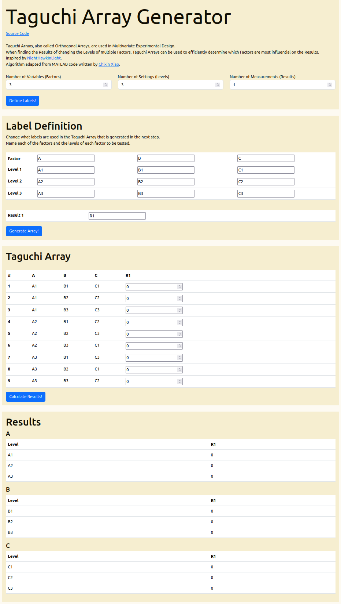

# Taguchi Array Generator
Multivariate Experimentation Tables

Taguchi Arrays, also called Orthogonal Arrays, are used in Multivariate Experimental Design.  
When finding the Results of changing the Levels of multiple Factors, Taguchi Arrays can be used to efficiently determine which Factors are most influential on the Results.  
Inspired by [NightHawkInLight](https://www.youtube.com/watch?v=5oULEuOoRd0).  
Algorithm adapted from MATLAB code written by [Chixin Xiao](https://www.mathworks.com/matlabcentral/fileexchange/71628-taguchiarray?s_tid=mwa_osa_a).

Available in browser [here](https://sskki-exe.github.io/TaguchiArrayGenerator/).

